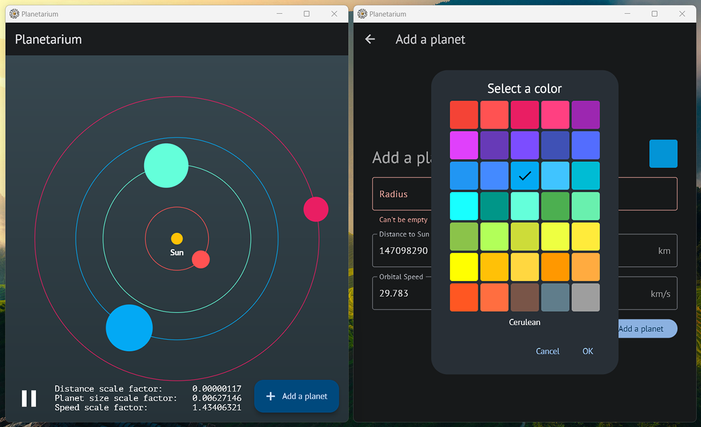

# Planetarium

## Задача
Реализовать приложение, отображающее планетную систему:
1. В центре экрана находится солнце
2. Вокруг солнца вращается N планет
3. Возможность добавить в систему любое количество планет
4. Добавление планеты на отдельном экране
5. При добавлении планеты можно задать радиус, цвет, удалённость, скорость вращения
6. Все планеты помещаются на экран

## Использованные инструменты
- Flutter
- GoRouter
- BLoC (Cubit)
- Formz

## Скриншоты

## Видео работы приложения
[→ Смотреть](https://drive.google.com/file/d/1E9UT75VFJPDfK4-cgMGGKWF8kWeJnJ5D/view)

Время разработки: 18 календарных часов
